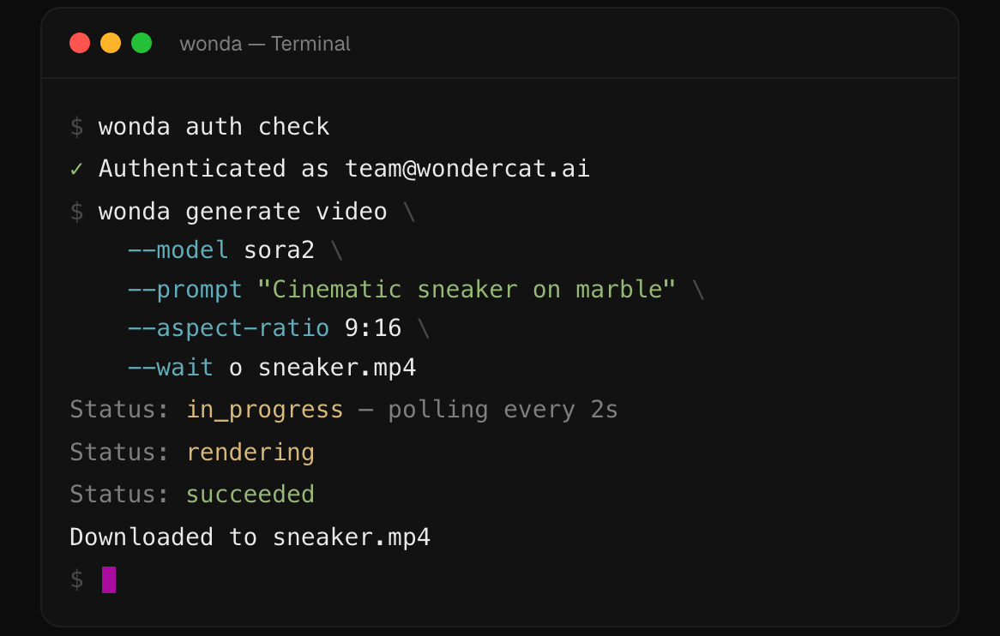
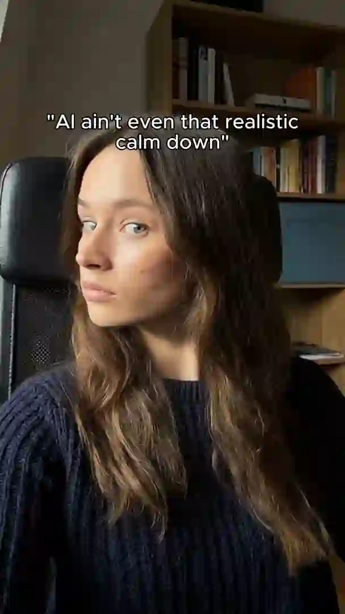
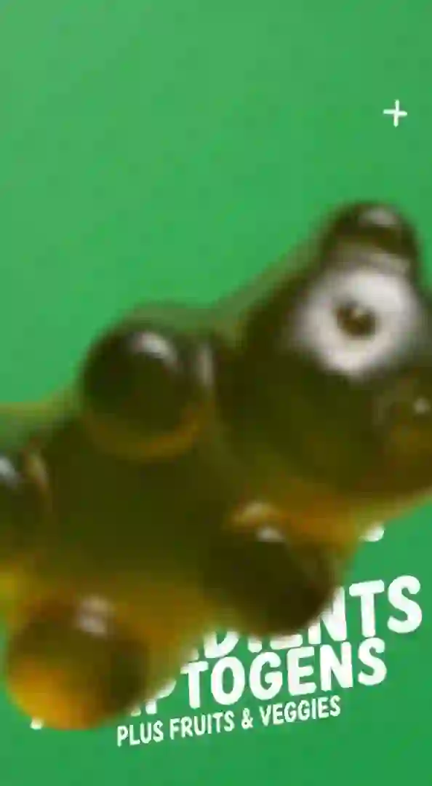

<div align="center">


**AI-powered content generation from your terminal**

Images, video, music, audio, editing, and social publishing — all via CLI.

[](https://github.com/degausai/wonda/releases)
[](https://www.npmjs.com/package/@degausai/wonda)
[](#platforms)
[](https://wonda.sh)

---

**You don't need to learn this CLI. Your agent already knows how to use it.**


and any agent that can run shell commands.

<br />



</div>

## Install


```bash
curl -fsSL https://wonda.sh/install.sh | bash
```


```bash
brew tap degausai/tap && brew install wonda
```


```bash
npm i -g @degausai/wonda
```

## Get started

```bash
wonda auth login          # Authenticate (opens browser)
wonda skill install -o .  # Install skill file for your AI assistant
```

Then ask your agent: *"Use wonda to generate a product video of this image."*

## Commands

### Generation

| Command | Description |
|---|---|
| `generate image` | Generate an image from a text prompt |
| `generate video` | Generate a video from a text prompt or reference image |
| `generate text` | Generate text content |
| `generate music` | Generate a music track from a text prompt |
| `audio speech` | Text-to-speech |
| `audio transcribe` | Speech-to-text |
| `audio dialogue` | Multi-speaker dialogue generation |

### Editing

TikTok/Reels-style video editing operations — designed for short-form social content.

| Operation | What it does |
|---|---|
| `animatedCaptions` | Auto-transcribe and burn animated word-by-word captions |
| `textOverlay` | Add styled text with custom fonts, positions, and sizing |
| `editAudio` | Mix background music with video audio (volume control) |
| `merge` | Stitch multiple clips into one video |
| `overlay` | Picture-in-picture — layer one video over another |
| `splitScreen` | Side-by-side or top-bottom split of two videos |
| `trim` | Cut to a specific time range |
| `speed` | Speed up or slow down |
| `splitScenes` | Auto-detect and split scenes |
| `extractAudio` | Pull the audio track from a video |
| `reverseVideo` | Play backwards |
| `skipSilence` | Remove silent gaps |
| `imageCrop` | Crop to a target aspect ratio |
| `birefnet-bg-removal` | Remove image background |
| `bria-video-background-removal` | Remove video background |
| `topaz-video-upscale` | Upscale video resolution (1-4x) |
| `sync-lipsync-v2-pro` | Sync lip movements to audio |

### Publishing

| Command | Description |
|---|---|
| `publish instagram` | Publish a single post |
| `publish tiktok` | Publish a single post |
| `publish instagram-carousel` | Publish a carousel (2-10 images) |
| `publish tiktok-carousel` | Publish a photo carousel (2-35 images) |
| `publish history` | View publish history |

### Marketing & Analytics

| Command | Description |
|---|---|
| `scrape social` | Scrape Instagram/TikTok profiles (posts, engagement, bio) |
| `scrape ads` | Search the Meta Ads Library for competitor ads |
| `analytics instagram\|tiktok` | Performance metrics for connected accounts |
| `brand` | View brand identity, products, website data |

### Media & Workflows

| Command | Description |
|---|---|
| `media upload\|download\|list` | Media library management |
| `blueprint list\|create\|run` | Blueprint workflow management |
| `skill list\|get\|install` | AI agent skill files and content guides |
| `models list\|info` | Available models and their parameters |
| `pricing list\|estimate` | Pricing info and cost estimates |

## Made with wonda

<p align="center">
&nbsp;&nbsp;
&nbsp;&nbsp;
&nbsp;&nbsp;

</p>

<p align="center"><em>Product videos, UGC-style content, ad creatives — generated, edited, and published from the terminal.</em></p>

## Examples

### Generate an image

```bash
wonda generate image \
  --model nano-banana-2 \
  --prompt "Product photo of headphones on marble" \
  --wait -o photo.png
```

### Generate a video from a reference image

```bash
MEDIA=$(wonda media upload ./product.jpg --quiet)
wonda generate video --model sora2 \
  --prompt "Slow orbit, dramatic lighting" \
  --attach "$MEDIA" --duration 8 --wait -o video.mp4
```

### Add animated captions (TikTok-style)

```bash
wonda edit video --operation animatedCaptions --media "$VID_MEDIA" \
  --params '{"fontFamily":"TikTok Sans","position":"bottom-center","highlightColor":"#FFD700"}' \
  --wait -o captioned.mp4
```

### Full pipeline: generate → music → captions → publish

```bash
# Generate a product video
VID=$(wonda generate video --model sora2 --prompt "Ocean waves" --wait --quiet)
VID_MEDIA=$(wonda jobs get inference "$VID" --jq '.outputs[0].media.mediaId')

# Add background music
MUSIC=$(wonda generate music --model suno-music --prompt "lo-fi ambient" --wait --quiet)
MUSIC_MEDIA=$(wonda jobs get inference "$MUSIC" --jq '.outputs[0].media.mediaId')
MIXED=$(wonda edit video --operation editAudio --media "$VID_MEDIA" --audio-media "$MUSIC_MEDIA" \
  --params '{"videoVolume":80,"audioVolume":30}' --wait --quiet)
MIXED_MEDIA=$(wonda jobs get editor "$MIXED" --jq '.outputs[0].mediaId')

# Burn in animated captions
FINAL=$(wonda edit video --operation animatedCaptions --media "$MIXED_MEDIA" \
  --params '{"fontFamily":"Montserrat","position":"bottom-center"}' --wait --quiet)
FINAL_MEDIA=$(wonda jobs get editor "$FINAL" --jq '.outputs[0].mediaId')

# Publish
wonda publish tiktok --media "$FINAL_MEDIA" --account tiktok_acct_123 \
  --caption "Summer vibes" --privacy-level PUBLIC_TO_EVERYONE
```

### Publish to Instagram

```bash
wonda publish instagram \
  --media med_abc123 \
  --account ig_acct_456 \
  --caption "New drop. Link in bio."
```

## Output formats

All commands output JSON to stdout. Errors go to stderr.

```bash
# Default — formatted JSON
wonda generate image --model nano-banana-2 --prompt "A cat"

# Quiet — just the ID, useful for shell variables
JOB=$(wonda generate image --model nano-banana-2 --prompt "A cat" --quiet)

# Field selection
wonda jobs get inference "$JOB" --fields status,outputs

# Built-in jq (no external dependency)
wonda generate image --model nano-banana-2 --prompt "A cat" --wait \
  --jq '.outputs[0].media.url'
```

When stdout is piped, JSON mode is enabled automatically.

## AI agent integration

Just point your agent at `wonda` — it reads `--help`, finds the built-in skill file, and figures out model selection, prompt strategies, and content workflows on its own.

```bash
wonda skill install              # Sync skill file to ~/.wonda/skill/
wonda skill install --all -o .   # Install main + all content skills locally
wonda skill list                 # Browse available content skills
wonda skill get product-b-roll   # Fetch a specific content guide
```

The skill file auto-syncs in the background. No configuration needed — your agent discovers it automatically.

## Pricing

An account is required. Sign up at [wonda.sh](https://wonda.sh).

Generations cost credits. Top up anytime:

```bash
wonda topup    # Opens Stripe checkout
wonda balance  # Check remaining credits
```

Use `wonda pricing estimate` to check costs before generating.

## Platforms

macOS · Linux · Windows — x64 + ARM64

## License

Proprietary — see [wonda.sh](https://wonda.sh) for terms.
